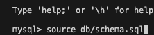
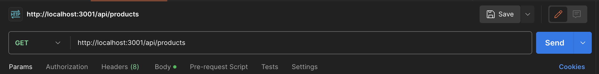

# ECommerce Back End

## Description

ECommerce Back End is a server side application that allows for the tracking of products that includes a category as well as many tags for addtional description of the product.

## Installation

Installation of Node.js is required to run this module. Additionally, The node packages sequelize, dotenv, mysql2 must be installed.

## Usage

To start using the Employee Tracker, first the MySQL database will need to be initiated. Log into MySQL in the Terminal and run the schema.sql from the db directory. Then seed the database by running node seeds in the terminal.

Since this is a back end only application an API platform such as Insomnia or Postman must be used to be able to interface with the application.

A video demonstration can be found at this link: https://drive.google.com/file/d/1-ueNaWQ5TjohrrG8ZykqHkSqUJUInlya/view?usp=sharing.

## Credits

Thanks goes to the University of Minnesota and Edx Bootcamp for providing the assistance needed to complete this project. I also would like to thank J. Bittner for assistance with the Employee Tracker ascii logo.

## License

MIT License

Copyright (c) 2024 helm0127

Permission is hereby granted, free of charge, to any person obtaining a copy
of this software and associated documentation files (the "Software"), to deal
in the Software without restriction, including without limitation the rights
to use, copy, modify, merge, publish, distribute, sublicense, and/or sell
copies of the Software, and to permit persons to whom the Software is
furnished to do so, subject to the following conditions:

The above copyright notice and this permission notice shall be included in all
copies or substantial portions of the Software.

THE SOFTWARE IS PROVIDED "AS IS", WITHOUT WARRANTY OF ANY KIND, EXPRESS OR
IMPLIED, INCLUDING BUT NOT LIMITED TO THE WARRANTIES OF MERCHANTABILITY,
FITNESS FOR A PARTICULAR PURPOSE AND NONINFRINGEMENT. IN NO EVENT SHALL THE
AUTHORS OR COPYRIGHT HOLDERS BE LIABLE FOR ANY CLAIM, DAMAGES OR OTHER
LIABILITY, WHETHER IN AN ACTION OF CONTRACT, TORT OR OTHERWISE, ARISING FROM,
OUT OF OR IN CONNECTION WITH THE SOFTWARE OR THE USE OR OTHER DEALINGS IN THE
SOFTWARE.
